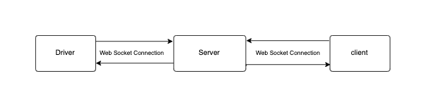

# Real Time Vehicle Tracking App

Real Time Vehicle Tracking App with web socket Built using Flutter


## Description

This is a demo project provide the idea how real time tracking work based on web socket protocol,
i used Bloc pattern to provide a more realistic example.

### The tracking process consist of three main elements.



- ### Driver

  Mobile Application or embedded device connected to the server and updating its location continuously.

- ### Client

  Mobile Application connected to the server updating its location and listing to nearest drivers locations continuously.

- ### Server

   Backend Server to Mange Connections between Clients and Drivers.
  
 This project is focusing on the client side, so i am using a server with single end point to mock the tracking web socket.

## How to use this project

Before you start you will need  Flutter SDK Installed,Google Maps Api Key,Dart Frog.

1. Config Android and IOS
   - Specify your API key in the application manifest android/app/src/main/AndroidManifest.xml  

      ``` xml
         <manifest ...
           <application ...
             <meta-data android:name="com.google.android.geo.API_KEY"
               android:value="YOUR KEY HERE"/>

   - Specify your API key in the application delegate ios/Runner/AppDelegate.swift

      ``` swift
        import UIKit
        import Flutter
        import GoogleMaps

        @UIApplicationMain
        @objc class AppDelegate: FlutterAppDelegate {
          override func application(
        _ application: UIApplication,
        didFinishLaunchingWithOptions launchOptions: [UIApplication. LaunchOptionsKey: Any]?
            ) -> Bool {
         GMSServices.provideAPIKey("YOUR KEY HERE")
         GeneratedPluginRegistrant.register(with: self)
           return super.application(application, didFinishLaunchingWithOptions: launchOptions)
            }
          }
      ```

2. Install Dart Frog

``` command line
dart pub global activate dart_frog_cli
  ```

3. Go to server root folder and run

  ``` command line
  cd real_time_vehicle_tracking_server
  ```

  ``` command line
  dart_frog dev
   ```

4. Run Flutter App

## Tools & Packages

- ### [dart_frog](https://pub.dev/packages/dart_frog)

- ### [dart_frog_web_socket](https://pub.dev/packages/dart_frog_web_socket)

- ### [flutter_bloc](https://pub.dev/packages/flutter_bloc)

- ### [google_maps_flutter](https://pub.dev/packages/google_maps_flutter)

- ### [web_socket_channel](https://pub.dev/packages/web_socket_channel)
